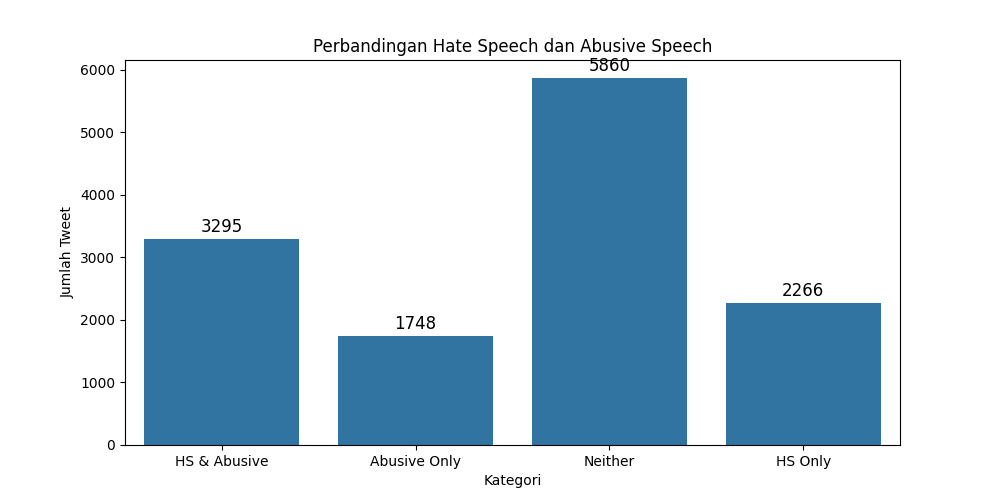
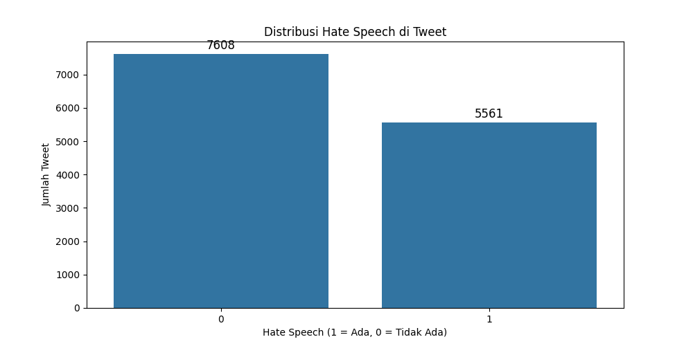

# Indonesian Abusive and Hate Speech on Twitter - Mental Health Impact

## Project Overview

This project explores the prevalence and impact of **Indonesian abusive and hate speech on Twitter**. The aim is to provide insights into how toxic behavior on social media affects mental health, especially in support of **World Mental Health Day**. Using a dataset sourced from **Kaggle** (https://www.kaggle.com/datasets/ilhamfp31/indonesian-abusive-and-hate-speech-twitter-text), this project applies text cleansing, exploratory data analysis (EDA), and visualization techniques to analyze the spread of hate and abusive speech in Indonesian tweets.

### Key Features:

- **Text Cleansing**: Cleaning noisy social media text (e.g., removing slang, abusive words, and special characters) using Python.
- **Exploratory Data Analysis**: Performing statistical and correlation analysis to uncover patterns of hate speech and abusive speech.
- **Visualization**: Data visualizations such as heatmaps, countplots, and bar charts to show the distribution and overlap of hate and abusive speech.

## Dataset Information

The project is based on a dataset containing over **13,000 tweets** from Kaggle. The dataset includes the following files:
1. **dataset.csv**: 
    - Contains tweet text and 12 columns categorizing hate speech (HS) and abusive speech.
2. **abusive.csv**: 
    - A collection of abusive words in Indonesian.
3. **new_kamusalay.csv**: 
    - Contains a mapping of slang or "alay" words and their normalized versions.

> **Note:** Due to the large size of the dataset, a smaller version (`data_mini.csv`) with 20 rows is available for quick testing in **Google Colab**.

## Project Structure

```bash
indonesian-hate-speech-analysis/
│
├── data/
│   ├── dataset.csv                 # Full dataset with 13,169 tweets
│   ├── data_mini.csv               # Mini dataset with 20 tweets for testing
│   ├── abusive.csv                 # List of abusive words
│   ├── new_kamusalay.csv           # Alay word dictionary with normalized equivalents
│   ├── cleaned_dataset_final.csv   # Final cleaned dataset
│   ├── decoded_abusive.csv         # Decoded abusive words
│   ├── decoded_dataset.csv         # Decoded tweets dataset
│   ├── decoded_kamusalay.csv       # Decoded kamusalay dataset
│
├── docs/
│   ├── swagger.yml                 # Swagger documentation for the API
│
├── images/
│   ├── countplot-comparison_of_hate_speech_and_abusive.png
│   ├── countplot-distribution_of_abusive_speech.png
│   ├── countplot-distribution_of_hate_speech.png
│   ├── dataset_structure.png
│   ├── heatmap-correlation_between_hate_speech_variables.png
│   ├── swagger-clean_text.png
│   ├── swagger-upload_csv.png
│
├── analysis.ipynb                  # Jupyter notebook for data analysis and visualization
├── app.py                          # Flask API for text cleansing and analysis
├── visualization.py                # Data visualization and analysis script
│
├── cleaned_abusive.csv             # Cleaned abusive words
├── cleaned_dataset_final.csv       # Cleaned final dataset
├── cleaned_dataset.csv             # Cleaned dataset
├── cleaned_kamusalay.csv           # Cleaned kamusalay dataset
│
├── Report.pdf                      # Final report summarizing the analysis and findings
├── requirements.txt                # Python dependencies required to run the project
├── tweets.db                       # SQLite database containing cleaned tweet data
```

## Setup Instructions

### Requirements

Before running the project, make sure you have all the necessary Python dependencies installed. You can install them using the `requirements.txt` file.

To install the required packages, run the following command:

```bash
pip install -r requirements.txt
```

## Running the Project

1. Clone the Repository: Clone the project repository from GitHub to your local machine:
```bash
git clone https://github.com/isumizumi/binar-datascience-repo.git
```

Change directory to ChallengeGoldLevel
```bash
cd ChallengeGoldLevel
```

2. Data Cleansing and Visualization: Run the visualization.py script to cleanse the data and generate visualizations:

```bash
python visualization.py
```

3. Run the Flask API: Start the Flask API to allow for text cleansing via endpoints:
```bash
python app.py
```

The API will be available at http://127.0.0.1:5000/apidocs.

> **Note:** The process will be very long because the dataset used is the original from kaggle (13K rows of data)


## Google Colab

If you prefer to run the analysis in Google Colab, a smaller dataset (data_mini.csv) with 20 rows is available for quick testing. You can access the Colab notebook by clicking here.

> **Note:** When running on Google Colab, use data_mini.csv for faster execution and testing.


## Data Cleansing Process

The cleansing function is essential for removing noise from social media text. It handles the following tasks:

- **Lowercasing the text**
- **Removing special characters (e.g., \n, \t, escape sequences)**
- **Normalizing alay (slang) words using new_kamusalay.csv**
- **Filtering out abusive words using abusive.csv**
- **Handling repeated words like "cantik2" by converting them to "cantik-cantik"**

## Results and Insights

- **Hate Speech Distribution**: 42.2% of tweets contain hate speech, while 57.8% do not
- **Abusive Speech Distribution**: 38.3% of tweets contain abusive speech, while 61.7% do not
- **Correlation Findings**: High correlation between weak hate speech and individual-targeted hate speech (0.96), indicating a frequent overlap between these categories

The analysis highlights the importance of addressing hate speech and abusive speech on social media platforms to mitigate their harmful effects on mental health

## Conclusion & Recommendations

- **Stronger Content Moderation**: Social media platforms should employ better automated detection systems for hate speech and abusive speech
- **Mental Health Support**: Regular campaigns should raise awareness of the negative impact of toxic online behavior on mental health

## Output

Here are some of the key visualizations generated from the analysis:

### 1. Comparison of Hate Speech and Abusive Speech
This chart shows the overlap between tweets containing hate speech and abusive speech, along with those containing only one or neither type of speech.


### 2. Distribution of Abusive Speech
This bar chart illustrates the distribution of abusive speech across the dataset. It highlights the number of tweets categorized as containing or not containing abusive speech.


### 3. Distribution of Hate Speech
This chart displays the distribution of hate speech, showing how many tweets were categorized as containing hate speech versus those that did not.


### 4. Dataset Structure
This image presents the structure of the dataset, showcasing the various columns and their types.


### 5. Correlation Between Hate Speech Variables (Heatmap)
This heatmap visualizes the correlation between different categories of hate speech. Darker colors indicate stronger correlations, helping to identify which types of hate speech tend to co-occur.


### 6. Swagger API - Clean Text Endpoint
This screenshot shows the **Swagger API** documentation for the `clean_text` endpoint, which allows users to input text for cleansing.


### 7. Swagger API - Upload CSV Endpoint
This screenshot displays the **Swagger API** documentation for the `upload_csv` endpoint, where users can upload a CSV file containing tweets for bulk cleansing and analysis.


## License

This project is licensed under the MIT License - see the LICENSE file for details.

## Acknowledgements

Data provided by Kaggle.
Visualization powered by Matplotlib and Seaborn.